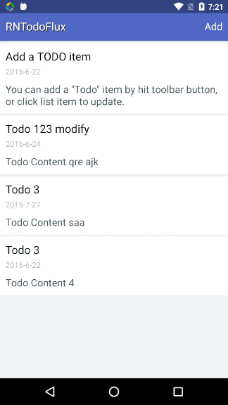
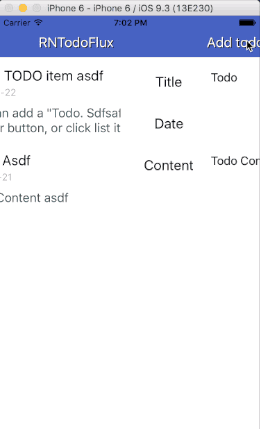

# RNTodoFlux
React Native todo-example, using ES6 & flux architecture & flow.

## Tech usage

- IDE - [Nuclide](https://nuclide.io/)
- Architecture - [Flux](https://facebook.github.io/flux/)
- Code check - [flow](https://flowtype.org)
- Event - [EventEmitter](https://nodejs.org/api/events.html)
- Data ORM - [AsyncStorage](https://facebook.github.io/react-native/docs/asyncstorage.html)
- Object copy - [object-assign](https://github.com/sindresorhus/object-assign)

## Android snapshot



## IOS snapshot



> Distortion in transaction of page which contains DatePicker seems a bug.

## Build

```
  git clone https://github.com/desmond1121/RNTodoFlux.git
  cd RNTodoFlux
  npm install
  react-native run-android
```
